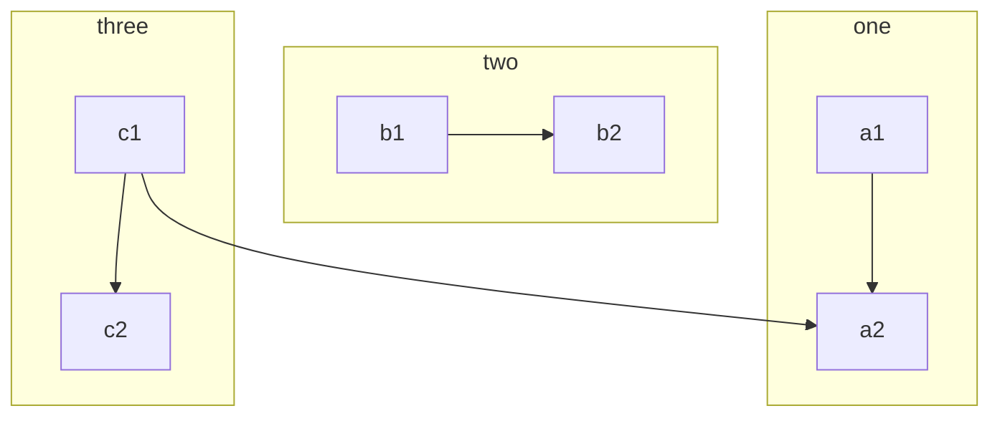
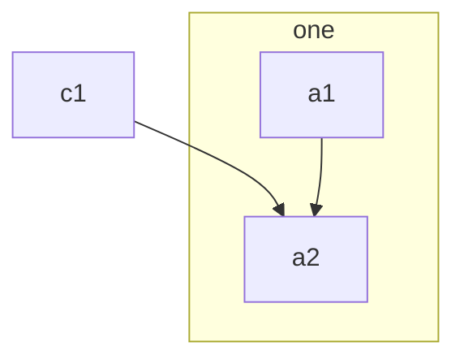
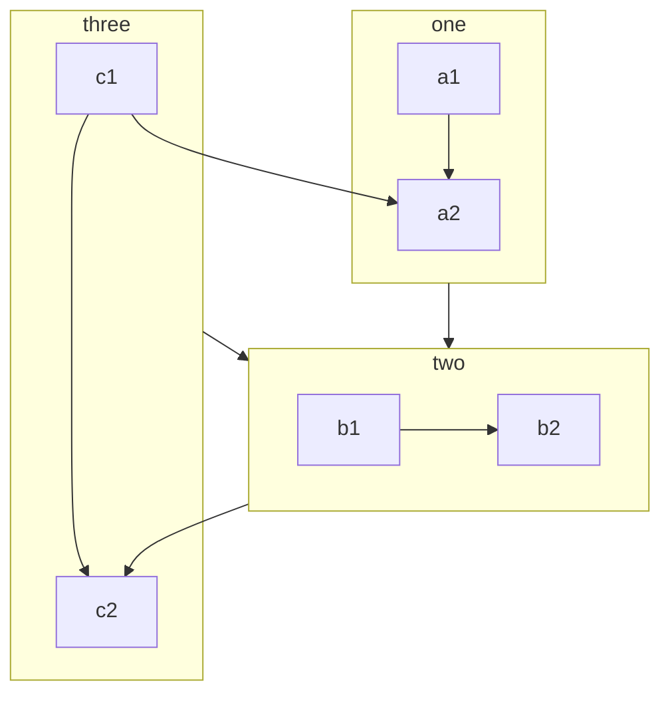
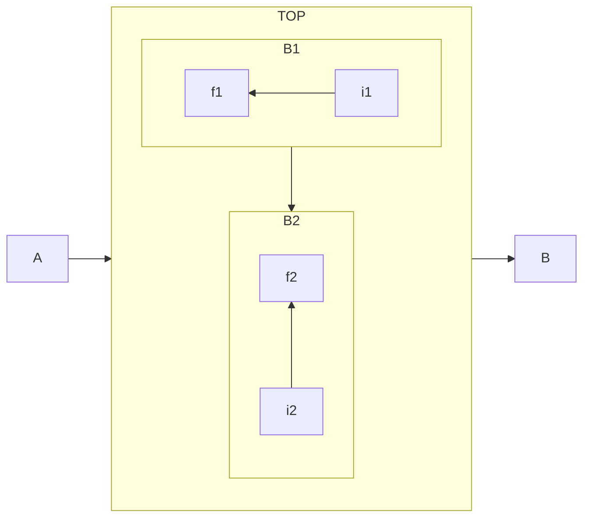
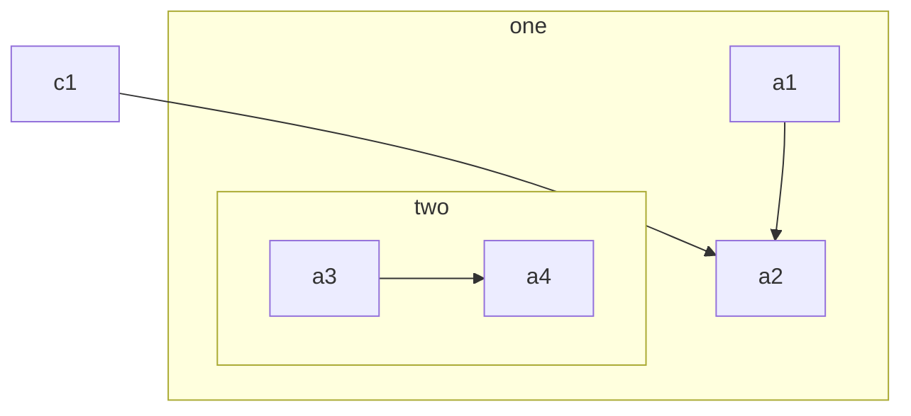

# Subgraph Implementation Specification

## Overview

This document contains the specifications and examples for implementing subgraph functionality in the Mermaid GUI editor.

## Mermaid Subgraph Documentation

### Basic Syntax



### Setting Explicit ID for Subgraph



### Flowchart with Subgraphs Between Edges



### Direction in Subgraphs



### Nested Subgraphs



## React Flow Group Node Example

Based on the React Flow documentation for nested flows:

```jsx
import { useCallback } from 'react';
import {
  ReactFlow,
  addEdge,
  useNodesState,
  useEdgesState,
  Controls,
  NodeResizer,
  getIntersectingNodes,
} from '@xyflow/react';

import '@xyflow/react/dist/style.css';

const initialNodes = [
  {
    id: '1',
    type: 'group',
    data: { label: null },
    position: { x: 0, y: 0 },
    style: {
      width: 170,
      height: 140,
    },
  },
  {
    id: '1a',
    type: 'input',
    data: { label: 'input' },
    position: { x: 10, y: 10 },
    parentId: '1',
    extent: 'parent',
  },
  {
    id: '1b',
    data: { label: 'node 1' },
    position: { x: 10, y: 90 },
    parentId: '1',
    extent: 'parent',
  },
  {
    id: '2',
    type: 'group',
    data: { label: null },
    position: { x: 0, y: 200 },
    style: {
      width: 170,
      height: 140,
    },
  },
  {
    id: '2a',
    data: { label: 'node 2' },
    position: { x: 10, y: 10 },
    parentId: '2',
    extent: 'parent',
  },
  {
    id: '2b',
    type: 'output',
    data: { label: 'output' },
    position: { x: 10, y: 90 },
    parentId: '2',
    extent: 'parent',
  },
];

const initialEdges = [
  { id: 'e1-2', source: '1', target: '2' },
  { id: 'e1a-1b', source: '1a', target: '1b' },
  { id: 'e2a-2b', source: '2a', target: '2b' },
];

export default function NestedFlow() {
  const [nodes, setNodes, onNodesChange] = useNodesState(initialNodes);
  const [edges, setEdges, onEdgesChange] = useEdgesState(initialEdges);
  const onConnect = useCallback(
    (params) => setEdges((eds) => addEdge(params, eds)),
    [],
  );

  return (
    <ReactFlow
      nodes={nodes}
      edges={edges}
      onNodesChange={onNodesChange}
      onEdgesChange={onEdgesChange}
      onConnect={onConnect}
      className="react-flow-subflows-example"
      fitView
    >
      <Controls />
    </ReactFlow>
  );
}
```

## Key Implementation Requirements

### 1. Parent-Child Relationships
- Child nodes must have `parentId` property pointing to their parent group
- Parent nodes must appear before child nodes in the nodes array
- When a parent moves, all children move with it automatically

### 2. Node Types
- Use `type: 'group'` for React Flow (not 'subgraph')
- Convert between Mermaid 'subgraph' and React Flow 'group' in converters

### 3. Drag and Drop Behavior
- When dragging a node over a group, highlight the group as a drop target
- On drop, if the node is inside a group, set its `parentId`
- Convert positions from absolute to relative when adding to a parent

### 4. Visual Hierarchy
- Groups should appear behind regular nodes (lower z-index)
- Groups can contain other groups (nested subgraphs)
- Groups should have a distinct visual style (dashed border, background color)

### 5. Position Handling
- Child positions are relative to their parent
- When adding a node to a parent, convert its absolute position to relative:
  ```js
  relativeX = absoluteX - parentX
  relativeY = absoluteY - parentY
  ```

### 6. Intersection Detection
Use `getIntersectingNodes` from React Flow to detect when a node is dropped on a group:

```jsx
const onNodeDragStop = useCallback(
  (_event, node) => {
    const intersectingNodes = getIntersectingNodes(node);
    const groupNode = intersectingNodes.find(n => n.type === 'group');
    
    if (groupNode) {
      // Set parentId and convert position
      node.parentId = groupNode.id;
      node.position = {
        x: node.position.x - groupNode.position.x,
        y: node.position.y - groupNode.position.y,
      };
    }
  },
  [getIntersectingNodes],
);
```

## User Specifications

1. **Node placement errors**: "Parent node N2 not found" warning
   - Must ensure parent nodes come before children in array
   - Use topological sort when converting nodes

2. **Drop behavior**: "ノードがsubgraphの内側にドロップされても親にならない"
   - Nodes dropped inside subgraphs must become children
   - Must update parentId on drop

3. **Z-index issues**: "subgraphがnodeやedgeより前面に出る"
   - Subgraphs must stay behind nodes and edges
   - Use CSS z-index to control layering

4. **Parent hierarchy**: "subgraphもsubgraphをparentに持てるようにする"
   - Subgraphs can have other subgraphs as parents
   - Support nested subgraph structures

5. **Drag behavior**: "ドラッグ・アンド・ドロップしたときにparent子関係を作る"
   - Create parent-child relationships via drag and drop
   - Visual feedback during drag (highlighting)

6. **TDD approach**: "t-wadaのTDDで実装すること"
   - Write tests first, then implementation
   - Follow test-driven development practices

## Current Issues

1. **Parent node not found error**: Occurs when dragging and dropping nodes onto subgraphs
   - Need to ensure proper node ordering in the array after parent assignment
   - May need to re-sort nodes after updating parentId